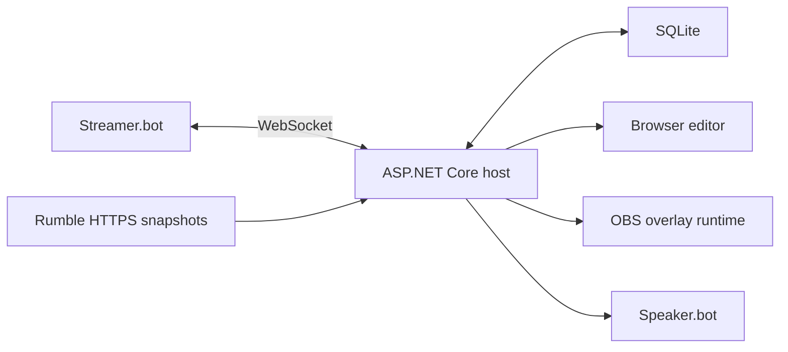

# Architecture

TDSBLive is a hybrid Streamer.bot companion, not an inline C# application.
Streamer.bot remains the integration/action authority. The host owns normalized
events, Rumble snapshot conversion, local services and browser transport.

## Build boundaries

- `ExtensionSuite.Core`: shared event, overlay, financial and automation contracts
  and invariants, including the polling-interval constraint.
- `ExtensionSuite.Data`: EF Core SQLite migrations and transactional repositories
  for events, checkpoints, outbox, non-secret configuration and redacted logs.
- `ExtensionSuite.StreamerBot` and `ExtensionSuite.Rumble`: independent implemented
  adapters, referencing Core rather than frontend or each other.
- `ExtensionSuite.Finance`: idempotent ledger/valuation/identity strategies in G07.
- `ExtensionSuite.Overlays` and `ExtensionSuite.Web`: implemented asset validation
  and transport/API services; later custom-widget functionality remains G12 work.
- `ExtensionSuite.Host`: composition root, HTTP editor assets, typed configuration,
  DPAPI provisioning, authenticated LAN, diagnostics, OpenAPI and editor WebSockets.
- `frontend/editor` and `frontend/overlay-runtime`: separate Vite build targets;
  editor-only dependencies must not enter the lightweight OBS runtime.

The foundation implements UUIDv7 events, transactional dedupe/checkpoint acceptance,
durable outbox, independent integration supervision and replay provenance. Actual
bot and Rumble adapters report their current connection/health state. Financial
projection and automation consume accepted events through separate durable paths.

The host serves the built editor; a separate Vite server supports development.
G05 supplies real OBS event transport; G06 supplies basic visual editing and
alerts, G08 donor widgets and G09 automation under the approved scope. G10 adds
packaging, guided setup and recovery. Integration receipts remain distinct from
operator-confirmed rendering/audio and native Windows qualification.
