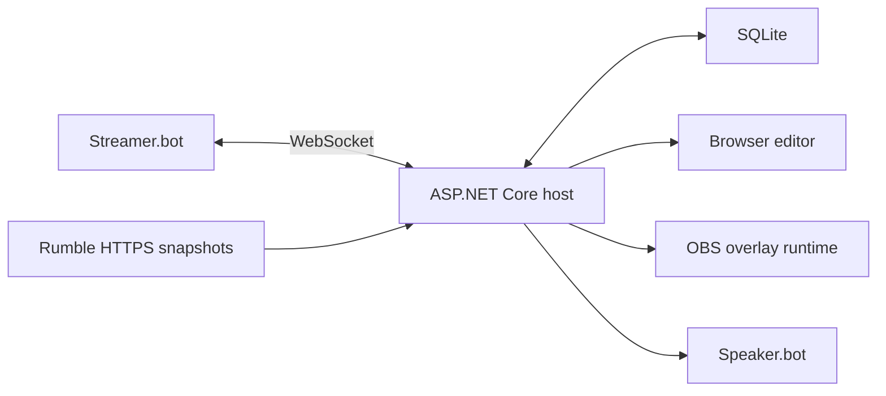

# Architecture

TDSBLive is a hybrid Streamer.bot companion, not an inline C# application.
Streamer.bot remains the integration/action authority. The host owns normalized
events, Rumble snapshot conversion, local services and browser transport.

## Build boundaries

- `ExtensionSuite.Core`: shared contracts and invariants. G01 supplies the
  polling-interval constraint; it does not implement the Rumble adapter.
- `ExtensionSuite.Data`: EF Core SQLite migrations and transactional repositories
  in G02 onward; currently a project/dependency boundary without a database engine.
- `ExtensionSuite.StreamerBot` and `ExtensionSuite.Rumble`: independent adapters
  in G03/G04, referencing Core rather than frontend or each other.
- `ExtensionSuite.Finance`: idempotent ledger/valuation/identity strategies in G07.
- `ExtensionSuite.Overlays` and `ExtensionSuite.Web`: widget/transport/API services
  in their owning goals; empty build boundaries until implementation.
- `ExtensionSuite.Host`: composition root. G01's only endpoint is `/api/status`,
  returning product name and HTTP support; persistence/auth/OpenAPI are G02 work.
- `frontend/editor` and `frontend/overlay-runtime`: separate Vite build targets;
  editor-only dependencies must not enter the lightweight OBS runtime.

Normalized UUIDv7 events, transactional dedupe/checkpoint acceptance, durable
outbox, per-integration failure isolation and replay provenance are specified in
the implementation plan. A successful build of these boundaries does not make
those future services complete.

The editor and host are separate development servers in G01. G02 adds host asset
serving/configuration; G05 supplies real OBS event transport; G06 supplies visual
editing. Integration placeholders must never claim actual connections.
