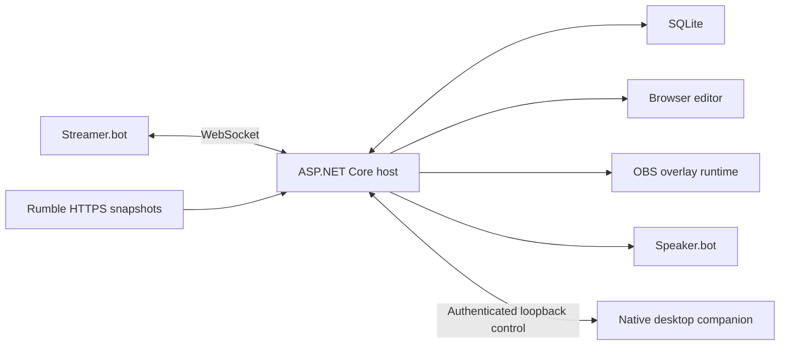

# Architecture

TDSBLive is a hybrid Streamer.bot companion, not an inline C# application.
Streamer.bot remains the integration/action authority. The host owns normalized
events, Rumble snapshot conversion, local services and browser transport.

## Build boundaries

- `ExtensionSuite.Core`: shared event, overlay, financial and automation contracts
  and invariants, including the polling-interval constraint.
- `ExtensionSuite.Data`: EF Core SQLite migrations and transactional repositories
  for events, checkpoints, outbox, non-secret configuration and redacted logs.
- `ExtensionSuite.StreamerBot` and `ExtensionSuite.Rumble`: independent implemented
  adapters, referencing Core rather than frontend or each other.
- `ExtensionSuite.Finance`: idempotent ledger/valuation/identity strategies in G07.
- `ExtensionSuite.Overlays` and `ExtensionSuite.Web`: asset validation and
  transport/API services. G12 adds mediated custom-widget state and portable packages.
- `ExtensionSuite.Host`: composition root, HTTP editor assets, typed configuration,
  DPAPI provisioning, authenticated LAN, diagnostics, OpenAPI and editor WebSockets.
- `ExtensionSuite.Desktop`: native tray, normal-browser handoff, Cancel-first
  confirmations and missing-tray controls. On Windows 1.0.1, the
  packaged host starts this companion and owns successful backend relaunch.
  The companion is separate from OBS rendering and production automation.
- `frontend/editor` and `frontend/overlay-runtime`: separate Vite build targets;
  editor-only dependencies must not enter the lightweight OBS runtime.

The foundation implements UUIDv7 events, transactional dedupe/checkpoint acceptance,
durable outbox, independent integration supervision and replay provenance. Actual
bot and Rumble adapters report their current connection/health state. Financial
projection and automation consume accepted events through separate durable paths.

The host serves the built editor; a separate Vite server supports development.
G05 supplies real OBS event transport; G06 supplies basic visual editing and
alerts, G08 donor widgets and G09 automation under the approved scope. G10 adds
packaging, guided setup and recovery. Integration receipts remain distinct from
operator-confirmed rendering/audio and native Windows qualification.

G11 completes advanced transforms and built-in widgets. G12 provides Monaco,
versioned custom manifests, capability-filtered opaque iframe/worker execution
and bounded portable packages. [G13](g13-compatibility.md) supplies the optional
local StreamElements shim and development/diagnostic tools; it adds no production
automation authority. The [requirements matrix](requirements-matrix.md) separates
implemented capabilities from explicitly deferred work and unavailable live evidence.

The [desktop lifecycle contract](desktop-lifecycle.md) describes authenticated
control, one owner per profile, graceful shutdown and explicit relaunch outcomes.
Closing a browser or desktop control window leaves a running backend alone.
Desktop failure also leaves the backend running; backend process death is never
treated as successful restart intent. The native Linux companion owns Wine/UMU
launch, retains the selected runner/prefix and holds a separate native profile
lease through backend crashes. Explicit recovery closes the stopped controls
before reopening the launcher. See [lifecycle](desktop-lifecycle.md),
[accepted issues](known-issues.md) and [1.0.1 evidence](tray-release-plan.md).
