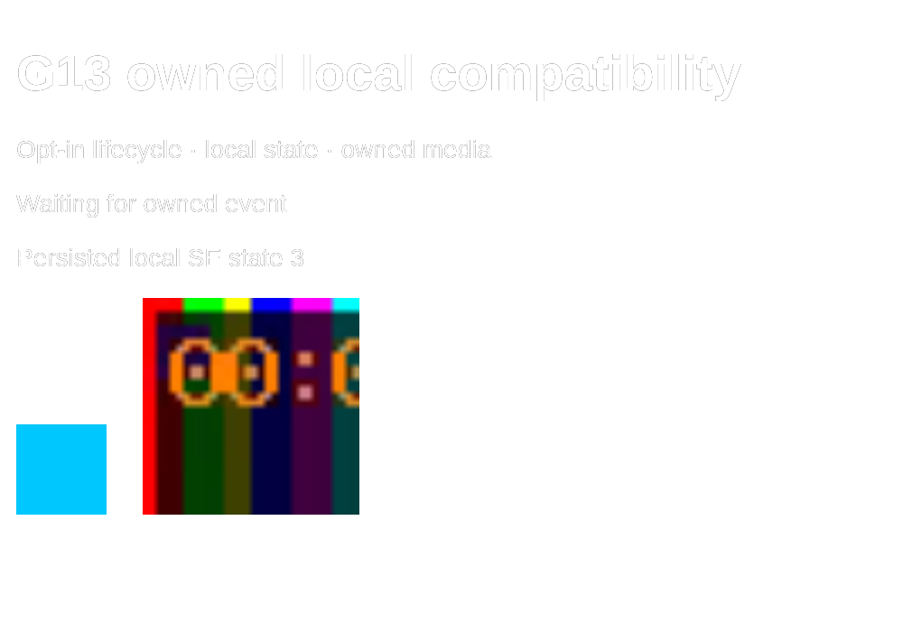

# Local compatibility and developer utilities

G13 completes the limited compatibility boundary in source-spec sections 47,
55–57, 87 and 92. It does not provide cloud StreamElements services or full
StreamElements compatibility. The [requirements matrix](requirements-matrix.md)
records implementation evidence and remaining live-evidence limits separately.

## Migrating an owned widget

Copy only widget source you own or are licensed to use into a custom widget's
Monaco HTML/CSS/JavaScript editors. Convert legacy fields into the documented
TDSBLive field array and configured values; there is no remote account importer.
Review source, select canonical subscriptions, then grant only required
permissions. Add this JavaScript line before existing handlers:

```javascript
const SE_API = SBX.enableStreamElements();
window.addEventListener('onWidgetLoad', e => {
  document.getElementById('message').textContent = e.detail.fieldData.label;
});
window.addEventListener('onEventReceived', e => {
  if (e.detail.listener === 'message') {
    document.getElementById('message').textContent = e.detail.event.message.text;
  }
});
```

The opt-in shim runs inside the existing opaque iframe and virtual-DOM worker.
It adds no network, parent access, audio, raw, financial or storage permissions.
`fieldData` contains configured fields. `onSessionUpdate` provides local status;
`session.data` is an empty object, because cloud session totals are not available.
Chat uses listener `message`; all other events use their canonical TDSBLive type.
`event` is the permission-filtered canonical event, not a recreated cloud payload.
Migrate legacy accesses such as `event.name` to `event.user.displayName` explicitly.
No account/channel token or remote account identity is supplied.

`SE_API.getOverlayStatus()` resolves `{ isEditorMode, muted }`. Muted means this
widget lacks the audio capability; it does not inspect OBS's mixer or the user's
volume. `SE_API.store.get(key)` resolves a JSON object or null;
`store.set(key, object)` replaces the key's object. Keys are 1–64 ASCII letters,
digits, underscores or hyphens. Writes are serialized within the widget and
preserve other SBX state under a `se:` namespace. The same 32 KiB limit,
preview isolation, restart/backup retention and independent widget identities
apply. Notifications use `kvstore:update` and remain local to that widget.
They are not account-wide store notifications.

`widgetDuration` in configured fields holds non-chat events for at most 60
seconds. The local FIFO holds at most 100 events; overflow reports a warning.
`SE_API.resumeQueue()` releases the current hold and delivers the next event.
Chat bypasses the hold. This queue affects only this widget and cannot control
production alert, TTS or Streamer.bot queues. Cloud counters, filtering,
`setField`, store deletion and unknown API members throw descriptive errors.
Catch them in widget code to display a migration warning; uncaught errors use
the existing safe widget-failure display. Unsupported browser APIs, imports,
jQuery and direct media playback remain outside the sandbox's supported surface.

The public [StreamElements API reference](https://docs.streamelements.com/overlays/custom-widget)
and [widget events reference](https://docs.streamelements.com/overlays/events)
were checked on 2026-10-03 for API names. The local semantics above intentionally
have narrower permissions and scope. No proprietary source or assets were used.

## Inspector and sharing

The Event inspector records credential-redacted private samples. Rumble snapshot
entries additionally show observed field/type paths, unknown field/type pairs
against the 88-path G00 capture baseline, and added/removed pairs since the last
inspected snapshot in this process. Null-only capture paths changing to objects
are classified as unknown evidence. This does not infer subscriber/gift identity
or authorize money, alerts or actions. Tracking is bounded and disabled when raw
retention is off. Field names and messages can still identify people: keep
**Inspect sample**, **Copy sample** and **Save private fixture** private.

**Save sanitized shape** exports a shape-only JSON fixture. Every string becomes
`sample`, every number becomes zero, booleans become false and unknown field names
are replaced with local ordinal names. Nulls/container structure are retained;
arrays are capped at 100 elements and nesting at 32. It is useful for structural
regression cases, not dedupe, identity, financial or full-value replay. Review
even sanitized exports before publication; shape and aggregate counts can reveal
operational information. Export does not change the private local sample.

**Export sanitized diagnostics** in Backup and recovery includes only application
identity, generated time, OS family and aggregate event/outbox counts. It excludes
configuration, paths, credentials, logs, messages, supporter records and widget
code. Ordinary log downloads and full backups remain private.

## Developer tools

Normal users can use guided setup, inspector tests and Backup and recovery
without command-line tools. Developers use the pinned toolchains in
[development](development.md) and disposable application data.

| Utility | Command or internal tool | Effects and limits |
| --- | --- | --- |
| Database migration | Host startup / `DatabaseLifecycle.InitializeAsync` | Applies tracked EF migrations before serving HTTP; use a fresh data directory for development |
| Rumble capture replay | `TDSBLive.exe tools rumble-replay captures.jsonl.gz` | Production snapshot engine, chronological UTC polls; summary only; no host, database, bot connection, persistence or live actions |
| Event fixture replay | `python tools/developer.py event-replay --file fixture.json --host http://127.0.0.1:18474` | 1–100 canonical events through isolated test-event API; no persistence or live automation |
| Sample generation | `python tools/developer.py sample-event --file artifacts/owned-event.json` | Owned UUIDv7 canonical chat fixture; refuses an existing output |
| Database backup | Backup and recovery, or `python tools/developer.py backup --file artifacts/private-backup.zip --host http://127.0.0.1:18474` | Consistent application backup; private user content; no integration credentials |
| Log sanitization | `TDSBLive.exe tools sanitize-logs private-log.jsonl` | Shape-only JSONL on stdout; strips all values/unknown field names; original logs remain private |
| Diagnostic export | Backup and recovery, or `python tools/developer.py diagnostics --file artifacts/diagnostics.json --host http://127.0.0.1:18474` | Aggregate-only JSON; no private configuration/content |

For a managed build replace `TDSBLive.exe` with `dotnet
src/ExtensionSuite.Host/bin/Release/net10.0/ExtensionSuite.Host.dll`.
Rumble replay accepts canonical `RumblePoll` JSONL or scanner-approved recorder
rows with `observed_at`, `payload` and optional `outcome`/`http_status`. Both plain
and gzip inputs are bounded to 64 MiB; gzip expanded content is scanned before
JSON inspection. There are at most 100,000 rows, 2 MiB per row and depth 32.
The first poll establishes a baseline; reverse chronology and missing UTC
timestamps are rejected. Subscription/gift candidates remain unverified.

File inputs must pass the deterministic scanner. If scanning fails, stop, rotate
any credential at its source and remove it before retrying. The utility never
prints the scanner response, input, path or parser exception. Python replay reads
only workspace files, and HTTP utilities require an explicit loopback HTTP host.
They do not accept remote URLs or command-line credentials. Backups must be kept
private; a successful scan is not publication approval.

## Qualification



2026-10-03 local evidence: the production replay command processes all 785 public
captured polls, producing 97 chat events, four follows, one online/offline pair,
64 viewer changes and one like change after baselining. No Rant was newly observed
after baseline in this capture; this is not new live paid-event evidence. The
rendered browser suite passes local shim lifecycle/chat/storage reload and
unsupported-call handling, plus aggregate diagnostic download and G02/G05/G06/
G07/G08/G09/G11/G12 regressions. Real-process restart/restore retains both SBX and
local compatibility state with an open reconnecting browser. Actual OBS 32.2.2 /
WebSocket 5.7.4 displays the opt-in lifecycle text, owned chat update, opaque cyan
image and silent playing video. PNG alpha spans 0–1; two video crops differ by
532 pixels. Actual owned-host restart retains state 9; actual backup restore
returns state 3 with image/video intact. A one-second owned custom audio event
was played through OBS; the operator confirms it was heard. Prior program scene
and Studio Mode were restored, the owned input/scene removed and disposable host
stopped. The screenshot contains owned data only. These are Linux OBS/managed
host results, not native Windows application results.

Current available-environment baseline: Linux managed .NET, one active owned OBS
custom source, integrations disabled, no periodic screenshot observer. A
60.04-second idle interval measures 4.131% backend CPU; 180.04 seconds of ordinary
chat (360 owned canonical events, two/second, durable outbox/OBS delivery) measures
3.982%. One logical core is 100%; peak backend RSS is 224,079,872 bytes (224.08 MB /
213.70 MiB). Memory is below 300 MB in this workload; CPU exceeds the numeric
targets. No all-core normalization substitutes for the one-core comparison.
This baseline does not qualify enabled Rumble, connected bots, Wine or a native
Windows streaming PC. G10's accepted Wine deviations and native-PC evidence
limitation remain separate; the matrix does not mark the CPU requirement passing.

Final Windows, SonarQube and documentation/package evidence remains pending;
G13 is In progress.
