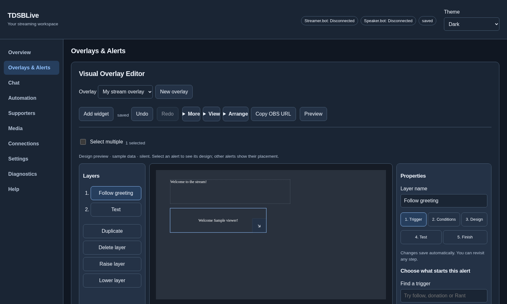
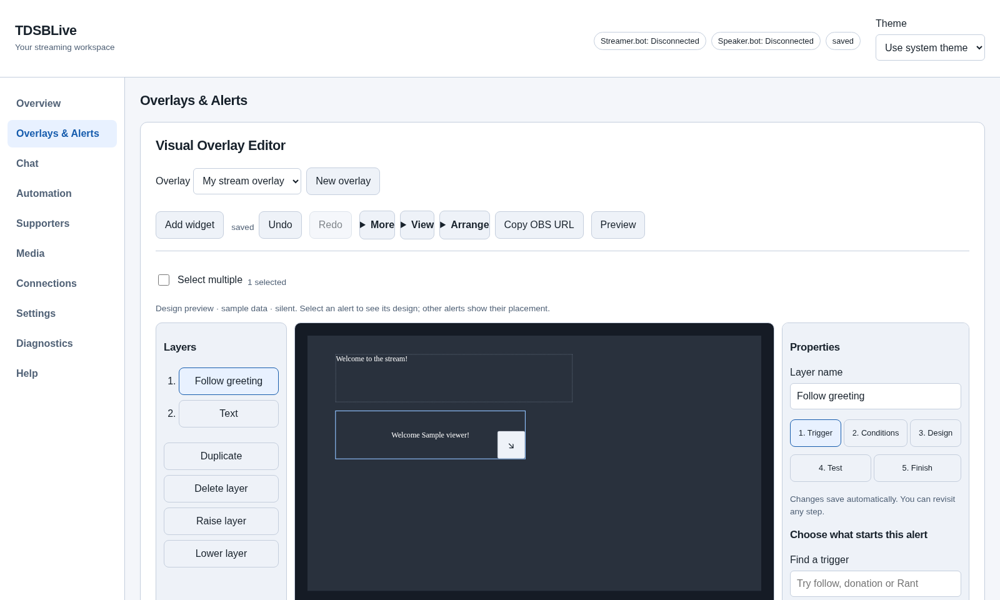
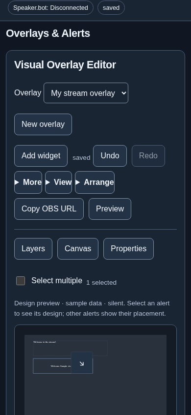
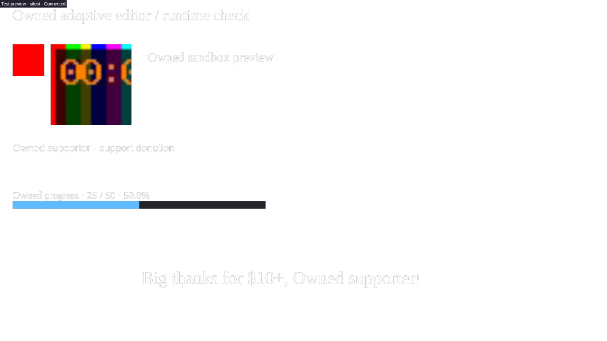

# Adaptive editor and guided alerts

These instructions apply to the adaptive interface shown below. Older builds
show settings together on one page. Your saved overlay addresses continue to work.

## Find your task

The editor separates **Overview, Overlays & Alerts, Chat, Automation, Supporters,
Media, Connections, Settings, Diagnostics, and Help**. Overview contains guided
setup. Connection and overlay save status appear above the workspace. Choose
**Use system theme**, **Light**, or **Dark**; this changes the editor's appearance
without recoloring your overlay.

On a narrow window, use **Menu** to find another page. Unfinished forms stay in
their workspace when you switch pages. Overlay changes save before navigation;
if saving conflicts, the editor retains your draft and asks you to resolve it.
**Reload saved version** discards the conflicting draft in favor of the saved
version. Copy anything you need to keep before reloading it.

## Create and arrange a design

1. Open **Overlays & Alerts**, then **New overlay**.
2. Name it and choose landscape, portrait, 4K or a custom pixel size. Its address
   is generated from the name; Advanced lets you change that address.
3. Choose **Add widget**, search for the kind you want, and add it.
4. Select it on the canvas or in **Layers**. Edit **Content**, **Appearance**, or
   **Placement** in Properties. Existing custom code, permissions, grouping,
   alignment, distribution, transforms and shortcuts remain available.
5. Use **Arrange** for group/alignment/order controls and **View** for fitting,
   grid, pan and zoom. **Select multiple** works without keyboard modifier keys.

At wide workspace sizes, layers, canvas and properties appear together. Smaller
workspaces offer **Layers / Canvas / Properties** buttons. On phones, a panel
opens over the canvas; choose **Canvas** to return to your design. Numeric
placement/size controls and arrange buttons provide alternatives to dragging.
**Fit canvas to window** follows resizing. Moving the Zoom slider keeps that
manual zoom until you choose Fit again. Window resizing does not change saved
widget coordinates or the overlay's pixel dimensions.

## Give different events different designs

Add an **Alert Box** for each design, and follow its five steps:

1. **Trigger:** search for a named incoming trigger, such as Twitch Follow,
   Ko-fi Donation, a new subscription, or a renewed subscription. Maintained,
   discovered and observed choices describe incoming events. Discovery does
   not prove paid-platform delivery. Outgoing Streamer.bot actions and code
   triggers are configured separately in Automation.
2. **Conditions:** choose every matching event, exactly, at least, a range or
   every multiple. Quantity covers items such as Bits or gifts. Reported money
   uses the event's own currency. Enter an ordinary amount, such as `5.00`.
   Currency suggestions choose decimal places automatically; Advanced retains
   manual scale controls for unusual integrations. Missing, unverified or
   incompatible support facts never satisfy a condition.
3. **Design:** change the wording, color and media. Insert a placeholder with
   a button instead of memorizing its spelling. Media choices show filenames.
4. **Test:** enter a sample quantity or ordinary amount and test the current
   draft. The chosen incoming identity is filled automatically. Results explain
   which designs match, including ordered donation tiers. **Test events** below
   the canvas also compares other triggers/currencies in the saved preview.
5. **Finish:** review the summary and copy your OBS URL after saving.

The canvas renders the current draft immediately. Selecting an alert shows its
design; other alerts show their placement outlines. Chat and supporter widgets
use labeled sample data. The saved test preview is separate from your live OBS
page. Preview audio starts off and is disabled when you leave the workspace.
Custom drafts run inside the existing sandbox, use memory-only storage and
block network access; failures are shown in the preview. Saved preview/live
custom permissions remain explicit.

## Choose one donation tier

Make a **Donation thanks** design for every Ko-fi donation, and a **Big donation**
design with **At least → Reported money amount → USD → 10.00**.

Open **Choose between alert designs**, name an alert set, and add its designs.
Move **Big donation** above **Donation thanks** and choose **First matching
design**. Test `5.00` and `10.00` in Test events. The results explain matches,
nonmatches and when an earlier design won. **All matching designs** lets every
matching design in that set play instead.

Set order selects a design before it enters its playback queue. A winner that
is cooling down or whose queue is full does not fall through to a later design.
Queue groups still control timing, concurrency, priority and interruption.
Alerts outside sets retain their existing independent matching behavior.

## Custom events, media and recovery

Owned custom broadcasts can declare `tdsbliveAlertTrigger` as an incoming
identity. Only reliably observed identities become individual choices.
Ambiguous custom messages remain generic custom events. Existing unknown
identifiers stay visible and editable under Advanced; loading them does not
replace them.

Use **Media** to search uploads, see thumbnails, check metadata/licensing and
deliberately preview a sound. Use **Settings** for backup/restore, configuration
transfer, startup, application controls and optional HTTP LAN access. Use
**Diagnostics** for readable health status or a sanitized diagnostic download.

Revision history, undo/redo, autosave and conflict handling remain available.
Portable exports containing conditional designs or alert sets use format v2;
older applications reject v2. Legacy-compatible content exports as v1, and this
build imports both formats. Imports give widgets and sets fresh identities and
keep custom permissions disabled until you review them.

## What OBS receives

The copied address shows your saved design on a transparent browser source.
Below is an isolated example with a donation tier, chat, local image/video,
custom text, event list and progress bar. The example uses sample events.

