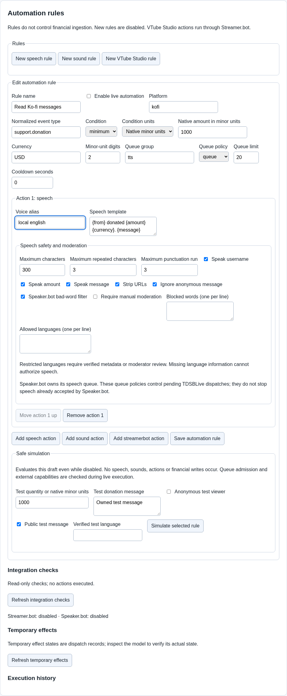

# Automation rules

A rule watches for an event and asks for an action, such as reading a Ko-fi
message aloud or playing a sound for Bits. Financial ingestion is independent:
disabling a rule does not disable supporter accounting.

## Create a speech or sound rule

1. Open **Automation rules** and choose **New speech rule** or **New sound rule**.
2. Give it a recognizable **Rule name**.
3. Review the platform, normalized event type, condition and units. Keep the
   supplied template values unless you understand the event you want to match.
4. For speech, set **Voice alias** to a voice configured in Speaker.bot. The
   current tested setup uses **local english**. Review the speech template.
5. For sound, choose the intended overlay/canvas and uploaded sound asset.
6. Review cooldown, queue group, queue policy and queue limit.
7. Leave **Enable live automation** unchecked while testing, then save.

This draft uses the tested **local english** voice alias. Live automation stays
unchecked; filling in the form does not speak or run an action.

For a USD donation, **Native minor units** means cents. With **Minor-unit digits**
set to `2`, enter `500` for a $5 minimum or `1000` for a $10 minimum. The example
uses $10, so smaller donations will not match it. For a Bits rule using
**Quantity**, enter the number of Bits instead. Always simulate an amount below
and an amount at your chosen minimum before enabling the rule.

A cooldown limits how frequently the rule can run. A queue waits its turn;
ignore skips when the group is busy; interrupt requests interruption according
to the action's supported behavior. Interruption is not a promise that every
external application can cancel an action already running.

## Simulate first

Use the rule's simulation controls to check its matching and planned actions.
Simulation does not execute live speech, sounds or Streamer.bot actions by
default. It also does not add production financial totals.

Then perform a bounded real audio/action test through the actual applications.
Check OBS rendering and listen to audio. A receipt saying dispatch succeeded
does not prove the audience can hear it.

## Enable live operation

Once filters, assets, permissions and audio routing are reviewed, check
**Enable live automation** and save. Monitor **Execution history** for outcomes.
Moderation or language-review states need review; failed or uncertain outcomes
are not successful actions. Avoid resending an uncertain external action until
you know whether it already happened.

Streamer.bot remains the action authority. VTube Studio work is on hold; use
Streamer.bot's built-in integration for that service. Its presence in legacy
rule controls does not establish TDSBLive VTube Studio qualification.

After restoring a backup, rules start disabled and old queued actions are
suppressed. Review each rule before enabling it again.
