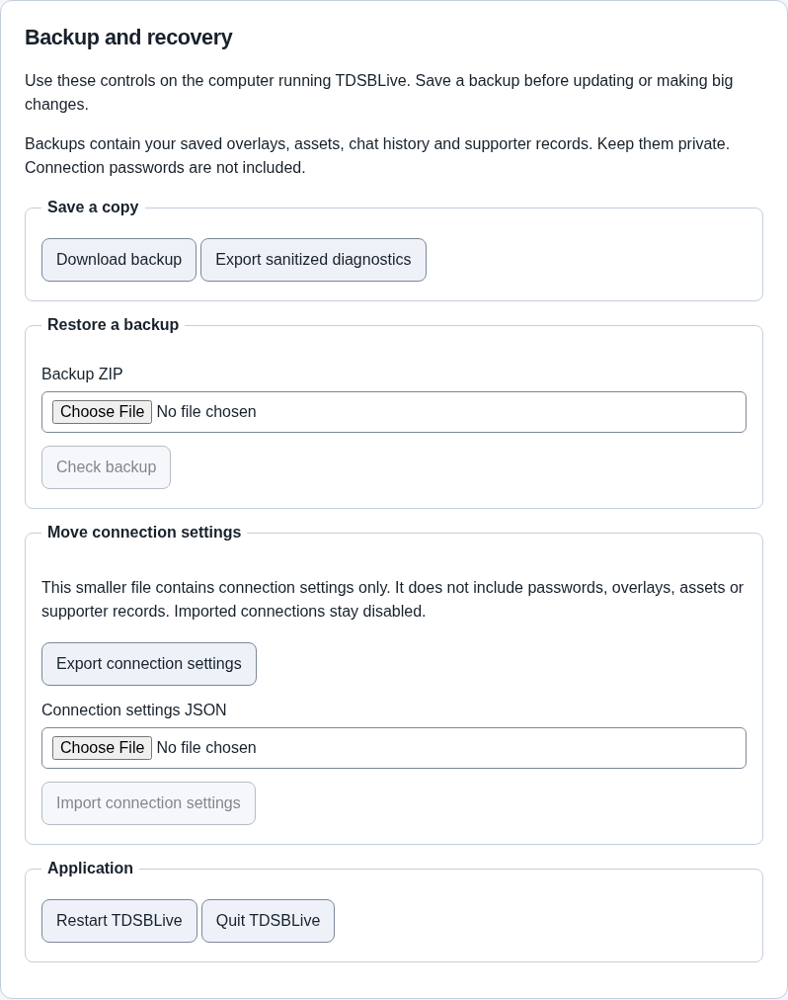

# Backup and recovery

A backup is a saved copy of your TDSBLive data. Keep one before updating the
application or making a large change.

## Save a backup

1. On the computer running TDSBLive, open the editor.
2. Find **Backup and recovery**.
3. Click **Download backup**.
4. Save the ZIP file somewhere you can find later. Keep another copy on a
   separate drive if possible.

The backup includes saved overlays, assets, chat history and supporter records.
Treat it as private. It does not include your connection passwords. Keep the ZIP
as it is; do not unpack, edit or rename the files inside it.

## Restore a backup

Restoring replaces the data you have now with the data saved in the backup.
Newer changes will no longer appear in the restored application.

1. Download a fresh backup of your current data first.
2. Under **Restore a backup**, choose your backup ZIP.
3. Click **Check backup**. This checks the file without replacing your data.
4. Read the replacement message. If this is the backup you want, check
   **I want to replace my current saved data with this backup**.
5. Click **Restore checked backup**. TDSBLive stops, keeps a safety copy of its
   current data, restores the checked copy and restarts.
6. Reopen the editor. Review your connections and automation before enabling
   them. Restored connections and rules start disabled, and old queued actions
   are not replayed.

The check expires after 15 minutes. If the restore button reports that the check
expired, choose **Check backup** again.

Use a backup made by the same application version. If checking fails, keep your
original file and try another known-good backup. Your current data has not been
replaced by the check.

Passwords already stored on this computer are retained separately. Moving a
backup to another computer does not move those passwords; enter them locally
again when setting up your connections.

## Move connection settings

**Export connection settings** downloads a smaller JSON file containing only
the application’s connection settings. It does not contain passwords, overlays,
assets or supporter records. For those records, use a backup instead.

To import it, choose the JSON file beside **Connection settings JSON**, click
**Import connection settings**, then restart TDSBLive. Review and enable the
connections you need. LAN access and imported connections start disabled.

## Restart or quit

**Restart TDSBLive** closes the host and starts it again. Chat and overlays may
briefly disconnect. Reopen the editor when the host is ready.

**Quit TDSBLive** stops the host. Close the editor tab afterward. Open TDSBLive
again when you want to use your overlays and integrations.

These controls are available only on the computer running TDSBLive. A remote
LAN editor cannot download private backups, restore data or stop the host.

## Portable overlays and widgets

Use the visual editor's **Export overlay**, **Export selected widget** and **Import portable package** controls to move layout, settings, custom code and referenced assets. These packages exclude credentials, viewing links and persistent custom-widget state. Import creates fresh identities and disables custom permissions. Full backups retain widget state; preview state stays separate from production state.
