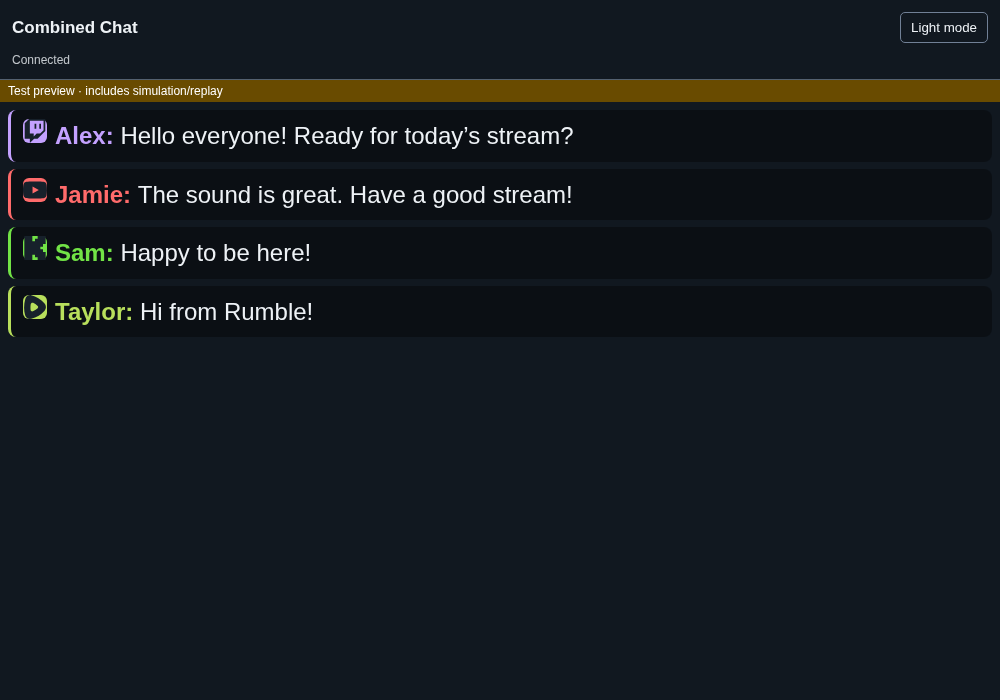
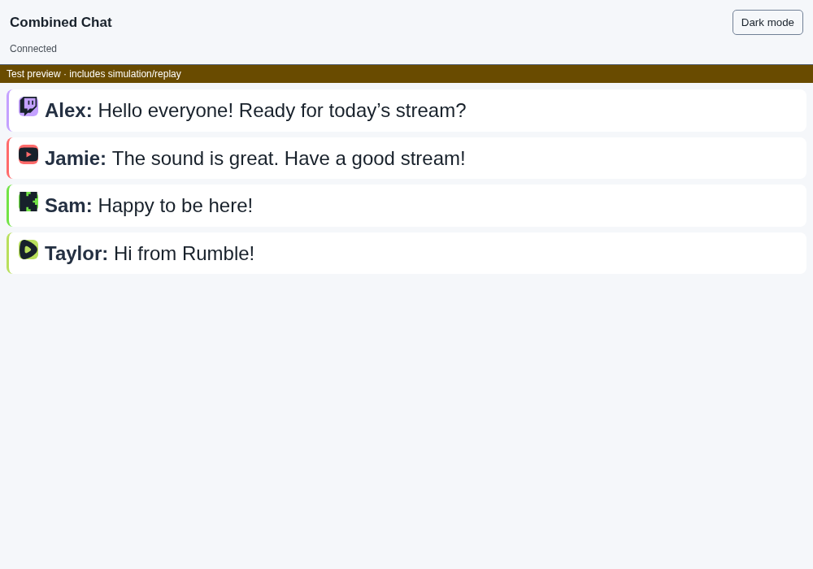
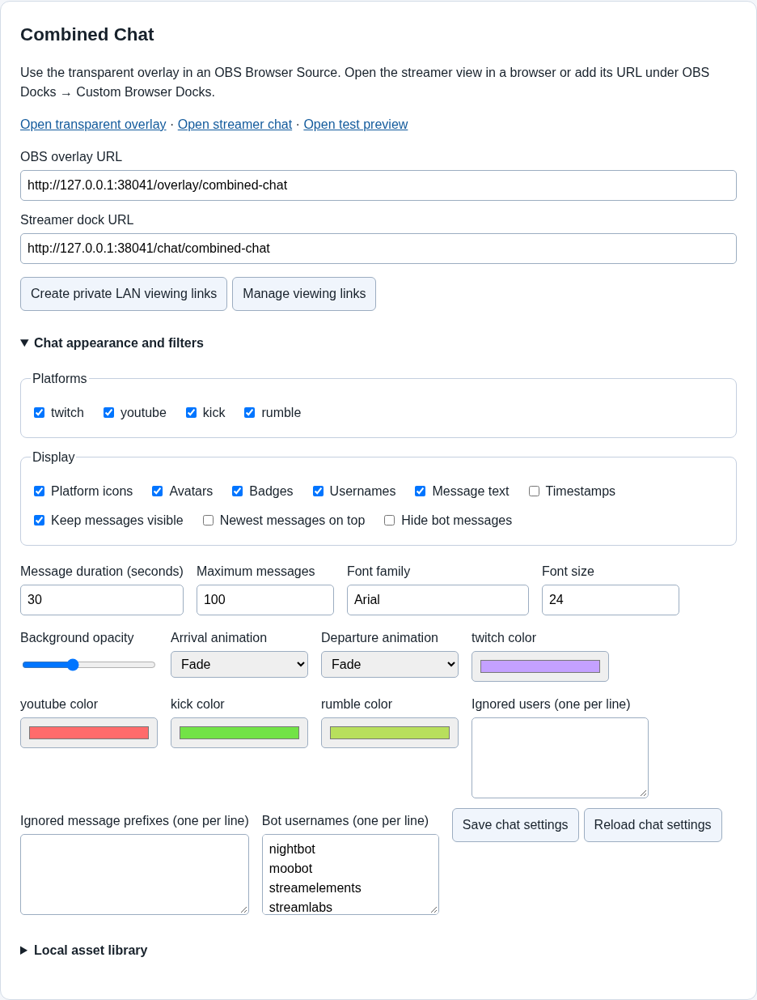

# Chat and OBS

TDSBLive gives you two chat views:

- **Transparent overlay:** chat that your audience sees on top of your video.
- **Streamer chat:** a light or dark chat window for you to read.

Both show the same combined chat. Changing the light/dark button in your own
chat window does not change the transparent overlay.

## Before you begin

Keep TDSBLive running. Open its editor at
[http://127.0.0.1:17474/editor](http://127.0.0.1:17474/editor).
This address means “this computer.” It does not work from a different computer.

For Twitch, YouTube or Kick chat, connect that account in Streamer.bot and
connect Streamer.bot in TDSBLive. For Rumble chat, connect Rumble in TDSBLive.
Turning on a platform checkbox only chooses what to display; it does not
connect an account.

## Put chat on your stream

1. In the TDSBLive editor, find **Combined Chat**.
2. Copy the **OBS overlay URL**.
3. In OBS, choose the scene where you want chat to appear.
4. Under **Sources**, press **+** and choose **Browser**.
5. Give it a name such as **TDSBLive Chat**.
6. Paste the copied address into **URL**. Leave **Local file** turned off.
7. Set the width and height to fit your layout, then press **OK**.
8. Drag the chat source into position. Send a fresh chat message to check it.

You should see the message over your scene, without a solid page background.
The default local address is
`http://127.0.0.1:17474/overlay/combined-chat`.

If **Browser** is missing from OBS, your OBS installation needs its browser
component. A different source type cannot display this web overlay.

## Put your reading window inside OBS

A **dock** is a panel you can keep beside the OBS preview. It is for you; adding
a dock does not put it on the stream.

1. Copy **Streamer dock URL** from **Combined Chat** in the editor.
2. In OBS, open **Docks → Custom Browser Docks**.
3. Enter a name such as **Combined Chat** and paste the address.
4. Press **Apply**, then close the settings window.
5. Drag the new panel where you want it.
6. Use its **Light mode** or **Dark mode** button to choose your reading theme.

You can also use **Open streamer chat** in the editor to read chat in an ordinary
web browser. The default address is
`http://127.0.0.1:17474/chat/combined-chat`.

These examples show the same made-up chat in each reading theme. The yellow bar
identifies a test preview; it is not part of your ordinary live chat.

## Change the appearance

1. Open **Chat appearance and filters** under **Combined Chat**.
2. Choose your platforms and the details to show, such as avatars, badges,
   platform icons or timestamps.
3. Change the font size, message limit or background opacity as needed.
4. Press **Save chat settings**.

Open views update automatically. If a change is not saved, it will not be kept.
**Reload chat settings** loads the saved version again and discards your unsaved
changes.

The screenshot uses a temporary test address. Copy the address shown in your own
editor rather than typing the screenshot's number.

**Keep messages visible** keeps messages on screen until the message limit
replaces older ones. If you turn it off, **Message duration (seconds)** controls
when messages disappear. **Newest messages on top** changes their order.

Put one name or prefix on each line in the filter boxes. For example, an ignored
message prefix of `!` hides messages beginning with `!`. To hide named bots,
list their usernames under **Bot usernames** and turn on **Hide bot messages**.

## Badges, emotes and GIFs

Supported Twitch messages can display badge images, native emotes and enabled
7TV, BetterTTV and FrankerFaceZ emotes. The channel's available emotes and the
metadata delivered by Streamer.bot determine what can be displayed. Twitch GIFs
use the recognized media information in the incoming message.

If an image is missing, first send a fresh message. An old message may have been
received before the connection or media information became available. Check
that Streamer.bot is connected and that the emote is enabled for your channel.

## Preview without going live

Use **Open test preview** in the editor when testing display changes. This opens
the preview version of the overlay. Keep previews separate from the browser
source used for your live stream; test events are not ordinary live chat.

## When something looks wrong

- **No new messages:** check the connection status in TDSBLive, then send a fresh
  message from a connected platform. Confirm that its platform checkbox is on.
- **Text is too small or crowded:** increase the font size or reduce
  **Maximum messages**, save, and resize the OBS source if needed.
- **A message disappears:** check **Keep messages visible** and the duration.
- **OBS has an old page:** refresh the Browser Source or dock after an update.
- **The address works on this PC but not another:** `127.0.0.1` always means the
  computer opening the page. Another computer needs authenticated LAN setup.

## Private viewing links

**Create private LAN viewing links** creates read-only links for this overlay.
It does not enable LAN access by itself. The links expire after 30 days. Keep
them private: someone with a valid link can view its chat.

Use **Manage viewing links → Revoke viewing link** to stop an old link working.
**Hide private links** only hides the newly displayed links from your editor;
it does not revoke them.

HTTP is supported. You do not need to install a certificate to use local chat
or authenticated LAN HTTP. Keep LAN access limited to devices you trust.
