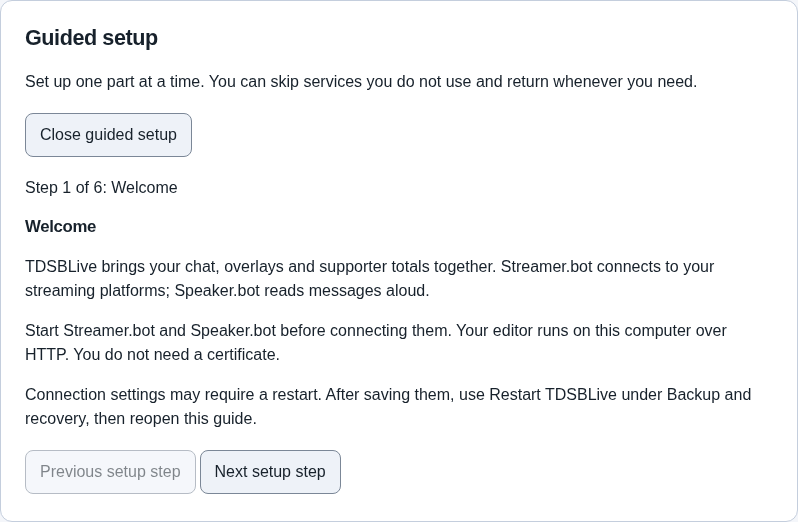

# First setup

> G10 release preparation: guided setup is available in the current development
> build. Final packaged setup and live integration qualification remain pending.

Open TDSBLive, then open
[the editor](http://127.0.0.1:17474/editor). **Guided setup** appears until you
finish its review. The guide remembers your step when you restart.

## 1. Start the helper applications

Start Streamer.bot and connect the streaming accounts you use there.
Streamer.bot supplies Twitch, YouTube and Kick events to TDSBLive and runs your
actions. Start Speaker.bot too if you want text read aloud.

You can skip a service you do not use. Moving to the next step does not
automatically enable integrations or run actions.

## 2. Connect the bots

1. In Streamer.bot, enable its WebSocket server under Servers/Clients. A
   WebSocket is the connection that lets these applications exchange events.
2. In guided setup, enter the same host and port. For applications on this
   computer, the host is usually **127.0.0.1**. The default Streamer.bot port is
   **8080**; use the port shown in your own server settings if it differs.
3. Choose **Save Streamer.bot connection**.
4. If using Speaker.bot, enable its WebSocket server and save its matching
   connection. TDSBLive defaults to port **7680**.
5. Restart TDSBLive using **Backup and recovery → Restart TDSBLive**. Reopen the
   editor and check the bot connection indicators.

If Streamer.bot requires authentication, enter its password in **Streamer.bot
authentication**. Leave the form unused if authentication is disabled.
Session-only storage is the default: enter the password after restarting to
apply connection settings. It is cleared on the next host restart. For the
Windows application, you can uncheck session-only storage to save it with your
Windows account's credential protection.

Do not paste passwords into public chat or screenshots. The form clears its
password input after a save attempt.

The TDSBLive trigger actions must be imported and registered in Streamer.bot
before Rumble trigger forwarding is enabled. Follow the extension import
instructions supplied with your qualified release. The setup guide does not
automatically prove that those triggers execute.

### Import the supplied actions

1. Open the TDSBLive application folder. Find
   **integrations → tdsblive-streamerbot.sb**.
2. In Streamer.bot, open its **Import** dialog and load that file.
3. Review the three TDSBLive actions: **TDSBLive bootstrap**, **TDSBLive
   qualification probe**, and **TDSBLive explicit forwarder**, then import them.
4. Run **TDSBLive bootstrap** once so its C# initialization registers the custom
   triggers. Check Streamer.bot's logs if compilation or registration fails.
5. In TDSBLive, refresh bot discovery and check that the TDSBLive triggers appear.

The bundle does not bind platform events or start production automation for you.
The qualification probe is for an isolated test. The explicit forwarder is a
template for events that require forwarding; do not attach it to every chat
event when the WebSocket already supplies that event, or you may duplicate it.
Real import and trigger execution were qualified with Streamer.bot 1.0.7;
other versions still need their own compatibility checks.

### Review action permissions

Open **Bot integrations → Streamer.bot action permissions**, then choose **Load
action permissions**. Select only the discovered actions you intend TDSBLive to
run. Disabled actions cannot be newly selected. Remove old permissions for
actions no longer available, then choose **Save action permissions** and restart.
Saving permissions does not run an action or enable a rule.

For Rumble custom triggers, check **Allow qualified live event forwarding to
Streamer.bot** here and **Forward qualified Rumble events to Streamer.bot** in
Rumble polling settings. Save both, restart and verify the trigger with an
isolated probe before attaching production automation.

## 3. Connect Rumble

1. Obtain your private Rumble Live API URL from your Rumble account.
2. Paste it into **Live API URL** under the Rumble setup step.
3. Keep **Keep credential only for this session** checked for a temporary test.
4. Click **Connect Rumble**.
5. Wait for **Baseline established**. This means TDSBLive has learned the current
   snapshot. Old chat and support in that snapshot do not create new alerts.

The URL is a credential. Keep it private. With session-only storage, you must
enter it again after restarting TDSBLive. Persistent storage requires the
Windows application and uses Windows credential protection.

Subscription and gift behaviors without verified Rumble payload evidence remain
gated. Do not assume connecting the API proves every event type works.

## 4. Set supporter periods and valuations

Choose your financial timezone. **Use browser timezone** fills the timezone
reported by your browser; check that it is the one you want. Save the financial
periods. Daily totals use this timezone and weeks start on Monday.

At the start of a stream, use **Use current time** for the stream start and save
it. That start is shared across platforms for current-stream totals.

Review any nominal valuation rules before using them. A nominal value is your
chosen estimate, not proof of the money received. Unknown values remain unknown
until evidence or an explicit valuation is supplied.

## 5. Add chat to OBS

Follow [Chat and OBS](Chat-and-OBS.md) to add the transparent chat source and
the reading dock. Send a new message on a connected platform and check that it
appears once. Use the dock's Light/Dark button to choose your reading theme.

## 6. Review and protect your setup

Check each integration you intend to use. For audio, listen through the actual
OBS audio path; a successful dispatch message alone does not prove audible
output. For the current Speaker.bot setup, the voice alias is **local english**.

Review action permissions, automation filters and cooldowns before enabling live
rules. Preview events are isolated from production totals and live automation.
VTube Studio work is on hold; use Streamer.bot's built-in integration.

Choose **Finish setup review** when you finish reading the checklist. This saves
your review preference, not a claim that every integration passed. You can open
guided setup again later.

Finally, [download a backup](Backup-and-Recovery.md). Keep it private and store a
copy away from the application folder.
