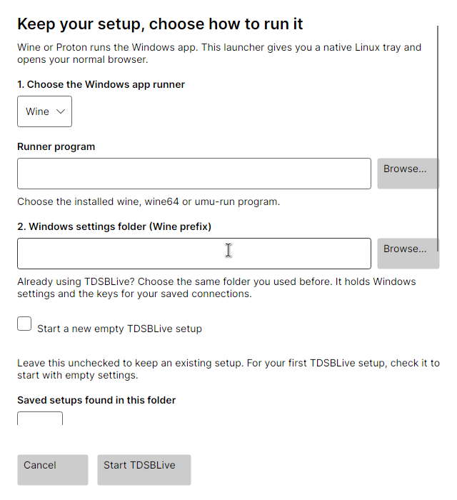

# Install on Linux with Wine

Wine lets a Linux computer run some Windows applications. TDSBLive still runs as the Windows application; your browser and OBS can remain normal Linux applications.

The project has live Wine qualification evidence, including Wine 11.17 Staging on the owner's machine. That is evidence for the tested setup, not a promise for every distribution or runner. Bottles instructions below follow its upstream documentation and are not a separate project qualification of every Bottles configuration.

## Use the native Linux launcher in 1.0.1

If Wine offers to install **Wine Mono** or **Wine Gecko**, choose **Cancel** for
those optional components. TDSBLive includes its own .NET runtime and uses your
normal browser. Its tested Wine setup runs without those extra installations.
Keep your existing settings folder; you do not need to delete it to dismiss the
prompt.



The **1.0.1 candidate** adds a native Linux tray and setup window. It is not
published yet. Download **`TDSBLive-1.0.1-linux-x64-wine.tar.gz`** when available.
It includes the Linux launcher, the complete Windows backend and .NET runtime.
A fully native Linux backend remains deferred.

1. Install Wine using your distribution's software manager or the
   [Wine project](https://www.winehq.org/). If your existing setup works, keep its
   runner and settings folder. Run TDSBLive as your ordinary user, without `sudo`.
2. Extract the complete Linux archive into a folder you will keep, such as
   `Applications/TDSBLive` in your home folder. Keep all extracted files together.
3. Open **`TDSBLive`**, the Linux launcher. If your file manager cannot start it,
   open a terminal in that extracted folder and enter `./TDSBLive`. The archive
   already gives it permission to run.
4. In **Set up TDSBLive on Linux**, choose **Wine** under
   **1. Choose the Windows app runner**. Check **Runner program**; use **Browse…**
   to choose the installed `wine` or `wine64` program if it was not found.
5. Under **2. Windows settings folder (Wine prefix)**, choose your existing
   prefix if you have used TDSBLive before. A prefix is Wine's folder containing
   its Windows-style drive, settings and connection keys.
6. Leave **Start a new empty TDSBLive setup** unchecked to retain your settings.
   Choose your setup from **Saved setups found in this folder**. If it is stored
   elsewhere, use **Existing TDSBLive setup folder** and **Browse…**.
7. For your first installation, choose a separate empty prefix and check
   **Start a new empty TDSBLive setup**. Read the displayed destination first.
8. Keep **3. TDSBLive Windows application** pointed to the included
   `backend/TDSBLive.exe`. Optionally check **Add TDSBLive to my applications menu**.
9. Choose **Start TDSBLive**. Keep the window open while Wine prepares the setup.
10. Check the editor in your normal Linux browser. Find the blue **T** in your
    desktop panel and use **Open editor**, **Restart** or **Quit** from its menu.

Save edits before restarting or quitting. A missing tray opens the
**TDSBLive is running** window with the same buttons. Closing that window or the
browser keeps TDSBLive running. See [Tray and desktop controls](Tray-and-Desktop-Controls.md).

The launcher saves its choices after the backend reaches its running state.
**Cancel** closes setup without creating a prefix. The optional application-menu
shortcut does not enable automatic sign-in startup. Keep the extracted folder in
place so the shortcut continues to work.

A different prefix can make saved settings appear missing. Return to your
original prefix instead of deleting data or starting an empty setup. Native Linux
OBS can use the local viewing URLs; check an overlay and sound before broadcasting.

## Optional: use the Windows ZIP directly

The following manual paths remain available for older downloads and existing
setups. The current public v0.1.0 release uses the Windows ZIP path. These paths
do not use the new native Linux launcher. Bottles remains a separate backend
workflow; native-companion support for Bottles is not qualified.

## 1. Choose direct Wine or Bottles

**Direct Wine** is useful if Wine already works on your computer and you are comfortable entering a short command. **Bottles** provides a graphical way to manage separate Wine environments. Choose one path for your first installation. Switching between them creates different environments unless you deliberately migrate your data.

Install Wine using the instructions for your Linux distribution and [Wine's official site](https://www.winehq.org/). Package names and commands differ between distributions, so a command for Ubuntu should not be copied blindly onto Arch or Fedora. Use a current compatible version; do not assume an old distribution package matches the project's tested version.

Run Wine as your ordinary user. TDSBLive does not need to be launched with `sudo`.

## 2. Download and extract the Windows ZIP

1. Download the application ZIP from [the project's releases](https://github.com/TechDaddyKB/tdsblive/releases). The Source code ZIP is not the application.
2. In your file manager, create an `Applications` folder in your home directory if you want one.
3. Extract the complete application ZIP into a folder named `TDSBLive` inside it.
4. Open that folder and check that `TDSBLive.exe` and its neighboring files are present.

The example below assumes the EXE is at `~/Applications/TDSBLive/TDSBLive.exe`. If the archive created an extra folder, locate the actual EXE and adjust the path. Do not run it from inside the archive.

## 3A. Start with direct Wine

A **prefix** is Wine's own Windows-style folder. It contains a pretend C: drive, settings and application data. Giving TDSBLive a separate prefix helps you keep its data apart from other Windows programs.

Open your application menu and look for **Terminal**. A terminal is a window where you type an instruction and press Enter. Copy the entire line below, paste it into that window, and press Enter. Many Linux terminals use Ctrl+Shift+V to paste.

```bash
WINEPREFIX="$HOME/.local/share/tdsblive-wine" wine "$HOME/Applications/TDSBLive/TDSBLive.exe"
```

This command tells Wine which environment to use and which program to open. `$HOME` means your home folder. The quotation marks keep paths with spaces together. Wine creates the prefix on its first use, so the first launch can take longer than later launches.

Use this **same prefix path** each time you launch or update the app. If you start it without `WINEPREFIX`, Wine may use its default environment instead, making your saved settings appear to be missing.

Leave the terminal open while you are checking the application. Use TDSBLive's **Quit TDSBLive** control when finished. If you later make a launcher shortcut, have it run this same command rather than changing the prefix.

TDSBLive's application package includes its .NET runtime. Do not install `dotnet48` just because this is a Windows application. That dependency belongs to other applications' instructions, such as Streamer.bot's Wine setup.

## 3B. Start with Bottles instead

Bottles officially recommends its Flatpak distribution. Install it using the link in [Bottles' installation guide](https://docs.usebottles.com/getting-started/installation), or find Bottles in your software center's Flathub source. Follow that guide if you need to set up Flatpak first.

1. Open Bottles and complete its first-run setup.
2. Create a new bottle. Give it a recognizable name such as `TDSBLive`.
3. Choose the **Application** environment for this ordinary application. Start with the supplied Wine runner unless you have a specific reason to choose another one.
4. Open that bottle's details.
5. Choose **Run executable**, browse to the extracted `TDSBLive.exe`, and run it.
6. Keep using this bottle for later launches. If you add a saved program entry, check that it opens the same EXE in the same bottle.

Upstream describes [environments](https://docs.usebottles.com/getting-started/environments) and [running an executable](https://docs.usebottles.com/bottles/run-.exe-.msi-.bat-.lnk-files). Button wording can vary between Bottles versions.

A Flatpak application has limited access to folders outside its own area. If the chooser cannot reach your extracted program, or neighboring assets are inaccessible, give Bottles access to **that application folder**. Its [folder access guide](https://docs.usebottles.com/flatpak/expose-directories) explains the options, including Flatseal. In Flatseal, select Bottles and add the specific folder under its filesystem permissions. Restart Bottles afterward. You do not need to grant access to your entire computer just to run this app.

## 4. Open the editor in your Linux browser

Open [http://127.0.0.1:17474/editor](http://127.0.0.1:17474/editor). You should see TDSBLive's editor or guided setup. No HTTPS certificate is required.

Wine is running on the same computer, so the local browser can reach this address. This is not the same situation as running an application inside a separate virtual machine.

Native Linux OBS can also use the local overlay URL. You do not need to run OBS inside Wine just to display a TDSBLive page.

## 5. Connect other programs only after TDSBLive works

Streamer.bot's Linux support is experimental. Follow [its own Linux installation guide](https://docs.streamer.bot/get-started/installation/linux), including its Wine dependencies. Its current guidance recommends Wine 11.9 or later and lists .NET Framework 4.8 and other components. Those requirements are separate from TDSBLive's bundled runtime. Speaker.bot's speech setup has additional requirements; the upstream Linux guide identifies SAPI as needed for it.

Do not move a working bot installation into a new prefix merely to put everything together. TDSBLive connects to the bots through their configured local WebSocket servers; they do not need to share a prefix.

## 6. Know where your saved data lives

With direct Wine, the usual location is inside the prefix's `drive_c/users` directory, then the Wine user's `AppData/Local/TDSBLive` folder. The Wine user name can vary. Bottles keeps each bottle in its own managed location.

Use TDSBLive's backup feature before changing environments. After quitting all applications in an environment, a separate copy of the entire prefix or bottle can protect environment-specific data too. Do not delete the original to troubleshoot a launch problem.

Use **session-only credentials** while getting started. Windows credential protection can behave differently under compatibility layers. If persistent credentials are unavailable, keep the session-only setting and enter the connection secret again after a restart. Do not create a plain-text workaround.

Next: [First setup](First-Setup.md). For problems, see [Troubleshooting](Troubleshooting.md).
