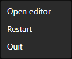

# Install on Windows

By the end of this page, TDSBLive should be running and its editor should be open in your browser. Connecting accounts comes next.

## 1. Download the application

Open [the official releases page](https://github.com/TechDaddyKB/tdsblive/releases). Choose the release you want, expand **Assets** if necessary, and download the Windows installer or the Windows application ZIP.

The installer is named `TDSBLive-<version>-win-x64-setup.exe`; the application ZIP is `TDSBLive-<version>-win-x64.zip`. Choose the version you intend to install.

Do not choose the links named **Source code** for an ordinary installation. Source code is for building the application yourself. The application package includes the runtime needed to launch TDSBLive.

Check the release's version and notes. The tray controls below describe the **1.0.1 candidate**, which is still being tested and has not been published. Older downloads use the editor's own restart and quit controls. [Before you begin](Before-You-Begin.md) explains the feature differences.

## 2A. Install using the installer

1. Open your browser's Downloads list, or the Downloads folder in File Explorer.
2. Run the installer you downloaded from this repository.
3. Follow the setup screens. This is a per-user installation, so installing for your account does not normally require administrator access.
4. Leave **start at login** off while learning unless you specifically want the application to start whenever you sign in. It is off by default.
5. Finish setup and launch TDSBLive using its installed shortcut.

Windows may ask whether you trust a newly downloaded application. Check that you obtained the file from the official project release before deciding whether to run it. If a managed computer blocks it, use your organization's normal approval process.

The usual program location is within your account's local Programs folder. Saved application data is under `%LOCALAPPDATA%\TDSBLive`, rather than inside the installed program folder.

## 2B. Install using the ZIP instead

Use this option instead of the installer if you prefer a folder you manage yourself.

1. Find the downloaded application ZIP in File Explorer.
2. Right-click it and choose **Extract All**.
3. Choose a local destination such as `C:\Apps\TDSBLive`. Use a folder you can write to.
4. Open the extracted folder. You should see `TDSBLive.exe` alongside several other files and folders.
5. Double-click `TDSBLive.exe`.

Extract **everything**. Do not drag out only the EXE, and do not run it from the ZIP preview. The neighboring files are part of the application. Avoid a cloud-synced folder for the running copy.

The ZIP includes the required runtime. Installing a separate .NET runtime is not the first fix for an incomplete extraction.

## 3. Find the app and open the editor

In the 1.0.1 tray build, starting the app yourself opens the editor in your normal
browser. Look for the blue **T** near the Windows clock. If it is hidden, select
the small up arrow beside the clock. Right-click the icon and choose **Open
editor** to return to the editor later.

The screenshot is from an owned Windows test of the 1.0.1 candidate. The
[illustrated tray guide](Tray-and-Desktop-Controls.md) explains the icon,
confirmations and the small control window used when the tray is unavailable.

If you choose optional start-at-login, the app starts quietly when you sign in.
Use **Open editor** when you are ready; it does not open a browser at every sign-in.

For an older build, or if you need to open the address yourself, enter this in
your browser's address bar while TDSBLive is running:

[http://127.0.0.1:17474/editor](http://127.0.0.1:17474/editor)

`127.0.0.1` means **this computer**. `17474` is the default local port. This address should be typed into the address bar, not into a search engine. If you changed the port, use your saved port instead.

You should see the editor or guided setup. You do not need an HTTPS certificate. The application must keep running for this page and your OBS overlays to work.

If you see “site cannot be reached,” first check that TDSBLive actually started. Do not keep launching extra copies. See [Troubleshooting](Troubleshooting.md) if one copy is already running.

## 4. Find the offline instructions

In a ZIP installation, open `guide`, then open `Home.html`. An installer installation also includes the guide with its installed program files. Keep its `images` folder beside the HTML pages.

These files are documentation, not the live editor. Opening `Home.html` does not start TDSBLive.

## 5. Stop and start it intentionally

Closing your browser closes your view of the editor; it does not stop TDSBLive.
In the 1.0.1 tray build:

1. Finish the broadcast in OBS and save your editor changes.
2. Right-click the blue **T** and choose **Quit**.
3. Read the confirmation. Choose **Quit** to stop, or **Cancel** to keep running.
4. The tray icon disappears when the app stops. Your saved setup stays available
   for the next launch.

You can also use **Quit TDSBLive** in the editor's **Backup and recovery** area.
That remains available for older builds. Restarting or quitting from the tray
does not save unfinished browser forms or close OBS and your bots.

Do not enable start-at-login until you have checked that one normal launch works. If you use a shortcut for a ZIP installation, keep the target pointing at the full extracted folder's EXE.

Next: [First setup](First-Setup.md).
