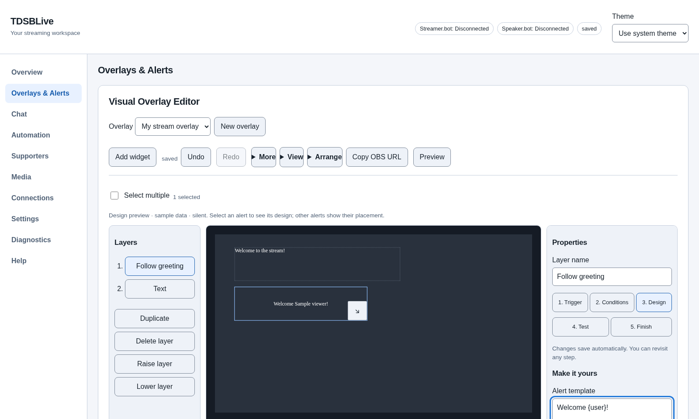

# Overlays and alerts

> The redesign candidate adds named trigger choices, adaptive panels and conditional designs. See [Adaptive editor and guided alerts](Adaptive-Editor-and-Guided-Alerts.md) for its workflow. Older installed builds keep their existing controls.

An overlay is a web page OBS places over your video. A widget is one item on that page, such as text, an image, chat or an alert box. Start with one small layout and test it before adding complexity.

## 1. Create a layout

1. Open the overlay area in the editor and create a new overlay.
2. Give it a name that describes its purpose, such as `Main alerts`.
3. Choose a canvas preset or size that matches how you intend to use it in OBS. The canvas is the editing area, measured in pixels.
4. Add a simple widget, such as text or an image.
5. Select the widget on the canvas or in **Layers**, then adjust its position and size.
6. Check the save status. Use **Save now** when you want an explicit save before a test.

An overlay ID is its internal name used in the page address. Copy the URL from the editor instead of guessing the address from its display name.

The picture shows the canvas and editing controls. The layer list helps you select an item that is hidden behind another item. Later items or layers can cover earlier ones.

## 2. Add images and other media

Use the asset controls to upload the file you want, then select it in the widget's settings. The application accepts assets up to 20 MiB each. If an upload is too large, create a smaller copy rather than repeatedly trying the same file.

Keep the original media elsewhere as well. A portable overlay package can include its assets, but a custom widget may have additional permission requirements before media can play.

## 3. Set up an alert box

Add an **Alert Box** widget. Choose the supported event types you want it to display, then configure its text and any media. Start with one event type so you can understand the result.

An alert is a brief response to an event. It is different from a chat widget that keeps showing a conversation. A working chat connection does not prove every paid or subscriber event has been verified.

Use the editor's test or preview controls with a made-up example. The preview is separate from the live OBS page. Its test should not be treated as an actual donation, and previewing does not establish delivery from a paid platform.

## 4. Check sound deliberately

Enable preview audio if you want to hear a preview. Then check your actual OBS source's audio behavior separately. Depending on OBS settings, browser audio may be routed through OBS rather than directly to your speakers.

Watch the relevant OBS audio meter and listen using the monitoring route you intend to use. Seeing a play indicator does not prove you heard a sound. Hearing a preview in your browser does not prove the broadcast receives the same audio.

Keep the test short and at a comfortable volume. Do not start a public broadcast just to find out whether a local source can play sound.

## 5. Add the saved overlay to OBS

1. Save the overlay and copy its live URL.
2. Add an OBS **Browser** source in your chosen scene.
3. Paste the live URL into **URL**, with **Local file** off.
4. Set the browser source's width and height to match the overlay canvas.
5. Confirm and check the actual OBS preview.
6. Trigger a safe local test, then verify its placement and any intended audio.

If the browser preview works but OBS does not, first check the copied address, scene, source visibility and dimensions. See [Troubleshooting](Troubleshooting.md).

## When you want more control

The published MVP provides basic overlay work. Newer builds add [advanced arrangement controls](Advanced-Editor-and-Widgets.md), [custom widgets and portable packages](Custom-Widgets-and-Portable-Packages.md), and [limited local compatibility](Local-StreamElements-Compatibility.md). Each advanced page explains its version requirement.

Next: [Everyday use](Everyday-Use.md), or make a [backup](Backup-and-Recovery.md) of your working layout.
