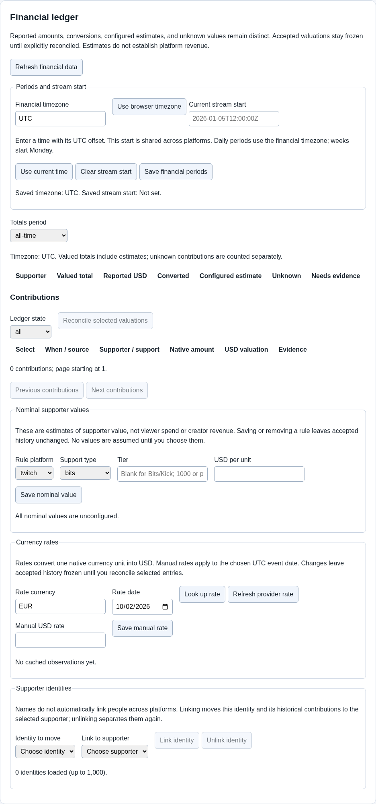

# Supporter totals: understand what the numbers mean

Supporter totals add up the events TDSBLive has recorded for a selected period. They help you display support on stream. They are not a bank statement and do not tell you what a platform will pay out after fees or other adjustments.

## 1. Choose the period first

Open the supporter totals area and select the period you want. A stream period uses the stream start time you set. Calendar periods use the configured financial time zone; weeks start on Monday.

Use **Use browser time zone** if that matches your reporting needs. If you change the time zone or stream start, events near the boundary can move into or out of the selected period. That is a change in the view, rather than proof that an event disappeared.

The picture uses example entries. Check both the period and the currency labels when reading your own totals.

## 2. Read the amount's label

An **exact** amount comes from an event with a known monetary value. A **nominal estimate** uses an assumed value where the actual amount is unavailable. An **unknown** amount cannot safely be turned into a money total.

For example, ten events with no known cash value should not silently become ten dollars. An estimate should remain visibly different from a confirmed amount.

Amounts in different currencies are not automatically interchangeable. A USD total and a EUR total represent different currencies. Check the chosen currency when using a ledger-based goal widget.

## 3. Use a deliberate stream boundary

Before a new stream, choose **Use current time** for the stream start if you want the stream period to begin now. Do not press it halfway through a show unless you intend to change the period's boundary.

A connection's baseline may suppress old events when it first connects. Connecting today is not a guarantee that all historical platform activity will be imported.

## 4. Link supporter identities carefully

A person may appear under different identities on different services. Use identity-linking controls only when you know the accounts belong to the same person. Similar names are not enough by themselves.

Review the combined result after linking. Keep a backup before large changes so you can recover an earlier known state if necessary.

## 5. Understand the evidence limit

Local qualification uses made-up, owned events to check calculations and presentation without spending money. Actual paid Rumble Rant, Ko-fi donation and Twitch Bits delivery remains unverified. Do not ask someone to pay just to complete the basic setup instructions.

A Goal widget in newer builds can display a manual amount or a selected currency's ledger total. Read [Advanced editor and widgets](Advanced-Editor-and-Widgets.md) for that feature and its version requirement.

Next: [Automation](Automation.md), or [Everyday use](Everyday-Use.md).
