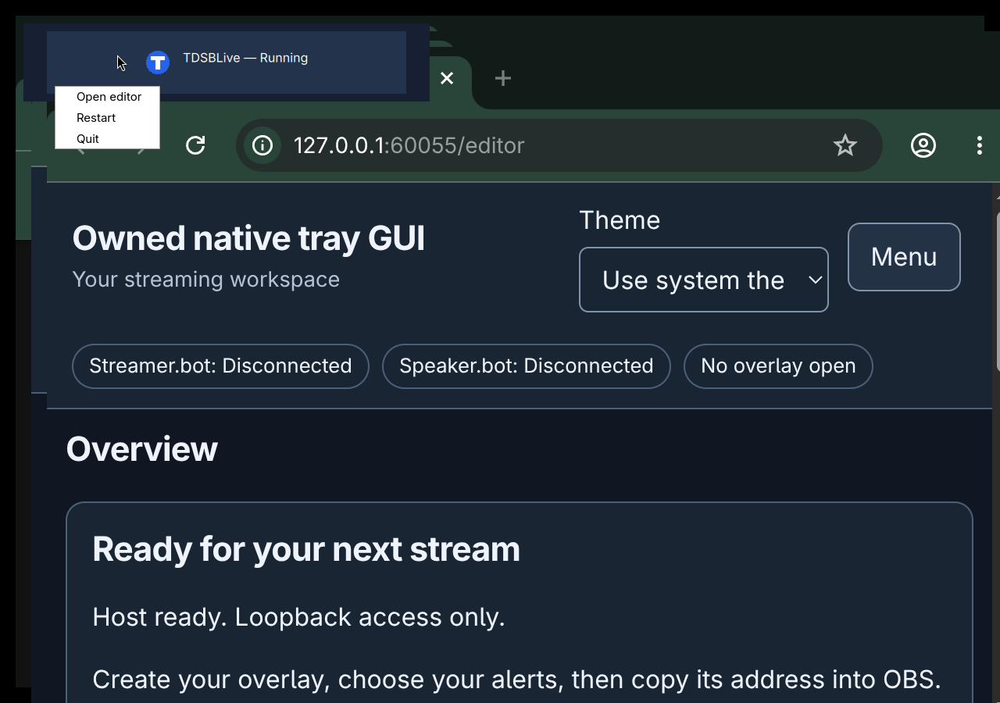
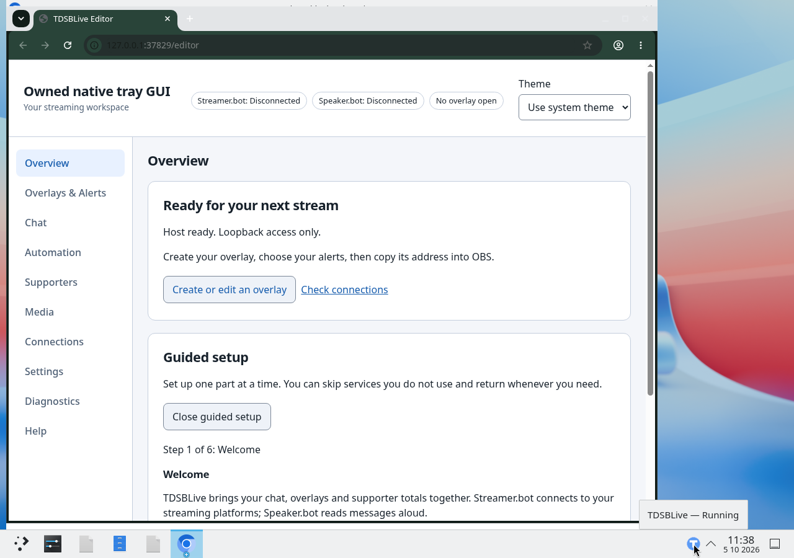
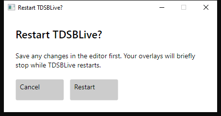
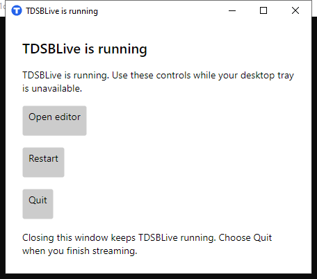

# Find TDSBLive, open the editor and quit

This page describes **1.0.1**. Use the guide bundled with your download if you
keep an older version.

TDSBLive runs in the background while OBS uses its chat and overlay pages. Its
small **tray icon** gives you a way to find it again and stop it when you finish.
Closing the editor's browser tab leaves TDSBLive running.

## Start it on Windows

1. Open **TDSBLive** from your installed shortcut, or double-click `TDSBLive.exe`
   in the fully extracted application folder.
2. Wait for the editor to open in your normal browser.
3. Look beside the clock on your taskbar for TDSBLive's blue icon with a white
   **T**. If you cannot see it, click the **up arrow** to show hidden icons.

If you chose **start at login** during installation, signing in starts the app
quietly. Use **Open editor** from its tray menu when you want the editor. This
setting does not start an OBS broadcast.

## Start it on Linux

Extract the complete Linux application archive and open its **TDSBLive** launcher.
On the first launch, follow [Wine setup](Install-on-Linux-Wine.md) or
[Proton/UMU setup](Install-on-Linux-Proton.md). Keep your existing runner, prefix
and saved setup if you are updating. Later launches reuse those choices and open
your normal Linux browser.

Look for the blue **T** in your desktop panel. Right-click it for the same three
actions shown below. Its position and menu appearance depend on your desktop.
The Linux launcher does not automatically start when you sign in. Its optional
applications-menu shortcut opens it when you choose that shortcut.

This Linux picture uses an isolated example panel and sample setup. Your desktop
panel can place the icon elsewhere; the three action names remain the same.

On KDE Plasma, hold your pointer over the icon to see whether TDSBLive is running.

This picture shows a qualification build with sample settings on an isolated KDE
desktop. The blue **T** beside the clock is TDSBLive's icon.

## Choose a tray action

Right-click the TDSBLive icon to open its menu.

| Choose | What happens |
| --- | --- |
| **Open editor** | Opens the editor in your normal browser, using the app's current address and port. |
| **Restart** | Asks for confirmation, stops TDSBLive briefly and starts it again with your saved setup. Your overlays pause while it restarts. |
| **Quit** | Asks for confirmation and stops TDSBLive. Its pages stop working until you start the app again. |

Opening your TDSBLive shortcut again also asks the running copy to open its
editor. You do not need to start several copies to find the editor.

## Restart without losing an unfinished edit

1. Save your changes in the editor and wait for its save status.
2. Right-click the tray icon and choose **Restart**.
3. Read the message. Choose **Cancel** if you still have something to save.
4. Choose **Restart** when you are ready for the brief pause.
5. Check your editor and OBS pages after the app starts again.

**Cancel** receives keyboard focus first. Pressing Enter at that point cancels.
Pressing Escape or closing the confirmation also cancels. Use Tab to move to
the action you intend before activating it.

Restarting does not save unfinished browser forms for you. Saved settings and
overlays remain available. Session-only connection secrets need to be entered
again after a restart.

## Finish a stream

1. End your broadcast using OBS's normal controls.
2. Save any final editor changes. Make a backup after important changes.
3. Right-click TDSBLive's icon and choose **Quit**.
4. Choose **Quit** in the confirmation.

The TDSBLive tray icon disappears when the app has stopped. Quitting TDSBLive
does not close OBS, Streamer.bot or Speaker.bot. Start TDSBLive again using its
shortcut when you next need it.

## If there is no tray icon

On Windows, first check the hidden-icons up arrow. On Linux, check your desktop
panel's tray area. GNOME may need its AppIndicator extension to show tray icons;
you can use the control window without adding an extension. When the tray is
unavailable, TDSBLive offers a small **TDSBLive is running** window with the same
three buttons.

If your Linux panel closes and no control window appears, use the editor's
**Backup and recovery** controls to restart or quit TDSBLive.

If the tray icon returns, you can close the control window and use the icon
again. Closing this window leaves the background app running. Choose **Quit**
to stop it. The editor's **Backup and recovery** controls remain another way to restart
or quit when the editor still works.

If desktop controls say TDSBLive stopped unexpectedly, check whether the editor
still works. If it does, use its application controls. If it does not, choose
**Close desktop controls**, then open TDSBLive from your shortcut. On Linux,
opening the shortcut while stopped controls are still open brings that same
window forward. It does not start another copy. Keep the same saved setup when
you reopen the launcher. See [Troubleshooting](Troubleshooting.md) if it cannot
start; do not stop other applications or delete your data to clear an unknown
port conflict.

For the older public v0.1.0 download, use the manual sections of the
[Wine/Bottles](Install-on-Linux-Wine.md) or [Proton/UMU](Install-on-Linux-Proton.md)
guides. Bottles remains a separate backend workflow; native-companion support
for Bottles is not qualified. A fully native Linux backend is a separate project.

Linux tray memory use and KDE's panel-only disappearance remain accepted issues
for future investigation. See [release limitations](https://github.com/TechDaddyKB/tdsblive/blob/main/docs/known-issues.md).

Next: [Everyday use](Everyday-Use.md), or [Backup and recovery](Backup-and-Recovery.md).
